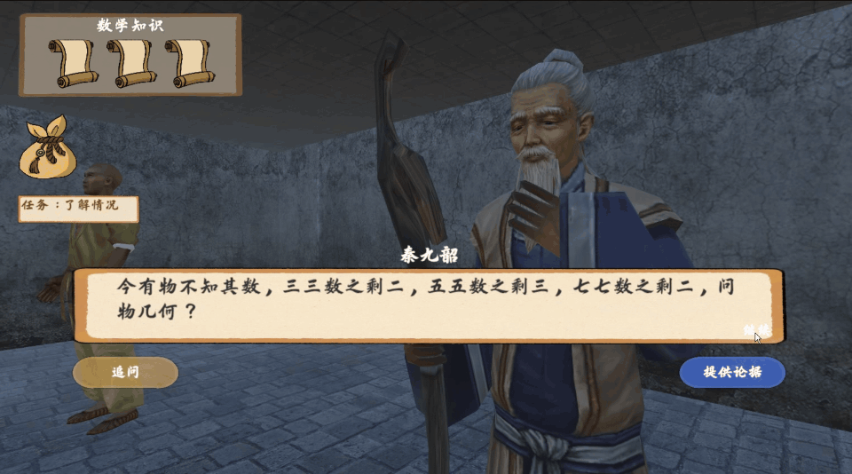
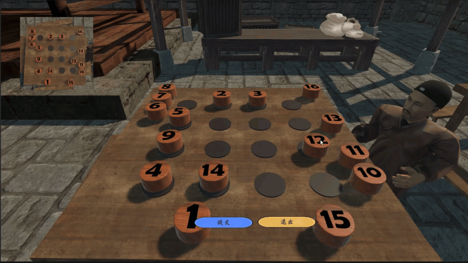

## 项目简介

**《古数解玄录》** 是一款3D教育类RPG游戏，计算机设计大赛参赛作品。本项目旨在通过沉浸式的游戏体验，引领玩家穿越时空，探索辉煌灿烂的中国古代数学世界。

在游戏中，玩家将扮演一位对古代智慧充满好奇的学子，穿梭于五个不同的历史时代，挑战以“纵横图”、“盈不足术”、“祖暅原理”、“勾股定理”等核心数学思想设计的关卡。玩家需要通过与场景的交互来解开谜题，完成古代数学家们的考验，并在与他们的对话和论证中，亲身感受古代学者们卓越的逻辑思维与数学智慧。

本仓库仅包含项目的核心代码（`scripts`）部分。

[demo演示点这里](https://www.bilibili.com/video/BV1accbefEtq)

## 技术实现

- **开发引擎**：`Unity 3D`
- **主要语言**：`C#`

### 1. UI 系统

- **动态文本效果**：集成 `DoTweening` 插件，实现对话文本的“打字机”动态显示效果，增强叙事感。
- **过场动画**：利用 `Timeline` 插件编排2D四格漫画，实现了电影化的开场叙事。
- **界面逻辑**：通过状态机模式管理复杂的UI面板切换与动画播放，保证了界面的流畅与稳定。



### 2. 角色与相机控制

- **角色动画**：使用 `Animator` 组件和混合树（Blend Tree）实现角色在行走与奔跑状态间的平滑过渡。
- **视角控制**：通过监听鼠标输入，平滑地调整相机环绕角和俯仰角，并利用鼠标滚轮输入实现了视野的动态缩放。

### 3. 物理引擎与特效

- **物理交互**：广泛使用 `Rigidbody` 和 `Collider` 组件实现场景物体的物理模拟与精确的碰撞检测，是关卡解密的核心。



- **视觉特效 (VFX)**：
  - **自定义着色器 (Shader)**：为水面、特殊光照及物体切割等效果编写了自定义Shader，提升了视觉表现力。
  - **人物透视**：实现了当角色被场景物体遮挡时，能够以轮廓线或半透明方式显示的效果，优化了玩家体验。


### 4. 场景设计与优化

- **场景搭建**：使用 `Blender` 制作3D模型，并在 `Unity 3D` 中进行场景的最终设计与搭建。

- **性能优化**：

  - **LOD (Level of Detail)**：对高面数模型进行了多层次细节优化，根据摄像机距离动态切换模型复杂度。
  - **摄像机剪裁 (Frustum Culling)**：仅渲染摄像机视锥体内的物体。
  - **遮挡剔除 (Occlusion Culling)**：不渲染被其他不透明物体完全遮挡的物体，有效降低了渲染开销，提升了游戏帧率。


### 5. NPC AI

- **自主巡逻**：利用 Unity 的 `AI Navigation` 系统和 `NavMesh`，实现了NPC在指定区域内的自主巡逻逻辑。

## 项目结构

由于本项目为参赛作品，暂不开源所有资源文件。当前仓库包含核心代码，结构如下：

```
.
├── scripts/              # C#脚本文件
├── screenshots/      # 游戏截图和GIF
├── .gitignore            # Git忽略配置文件
└── README.md             # 项目说明文件
```
